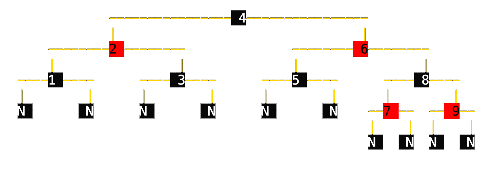

# STL-containers

## Description

The aim of this project is to reproduce some of basic STL-containers:
- [std::vector](http://www.cplusplus.com/reference/vector/vector)
- [std::stack](http://www.cplusplus.com/reference/stack/stack)
- [std::map](http://www.cplusplus.com/reference/map/map)
- [std::set](http://www.cplusplus.com/reference/set/set)

All containers are located in the ft namespace

ft::map and ft::set implementations are using red-black tree under the hood.

## Red-black tree
ft::rbt implemented as a independent container and could be used separately from set or map.
```c++
#include "rbt.hpp"

int main() {

    ft::rbt<int> tree;
    for (int i = 1; i < 10; i++) {
        tree.insert(i);
    }
    tree.erase(6);

    return 0;
}
```

## Console red-black tree visualizer

The visualizer implemented as a separated template class, with the same value type as the tree.

### Usage

These lines

```c++
#include "rbt.hpp"
#include "rbt_visualizer.hpp"

int main() {

    ft::rbt<int> tree;
    for (int i = 1; i < 10; i++) {
        tree.insert(i);
    }

    ft::rbt_visualizer<int> rbv;
    rbv.visualize(tree);
    
    return 0;
}
```

will produce this output to stdout: <br>


## Compile

To compile properly you need to explicitly specify the path to the main folder of this repo.

For example:
```bash
clang++ test.cpp -I ~/Desktop/STL-containers
```

## Tests

